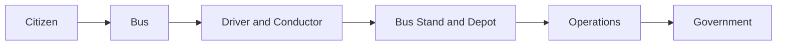

# 01 · Product brief

**Status: LOCKED.** Source: [99-source-product-plan.md](99-source-product-plan.md) sections 1 to 4 and 110 to 113.

## What we are building

AP TransitOS is not a booking website. It is one connected digital transport system for Andhra Pradesh that links citizens, buses, drivers, conductors, depots and government.

## Principle

**Make public transport easier without making the app complicated.** The technology can be advanced. The experience stays simple.

- Aim for: simple, fast, clean, reliable, professional.
- Avoid: too many buttons, menus, alerts or details. Complicated booking or ticketing.
- Test for every screen: can a first time user finish the main task without help?

## Users

| User | Main job in our app | Surface |
| --- | --- | --- |
| Citizen | Find a bus, book, pay, activate, show ticket, track, buy passes, give feedback | Citizen web app (PWA) |
| Driver | See the trip for today, start trip, share GPS, report issues, end trip | `/driver` (PWA, large buttons) |
| Conductor | Scan tickets fast, see trip counts | `/conductor` (PWA, scanner first) |
| Depot staff and manager | Watch buses and trips, handle incidents, assign replacements, manage fleet and timetables | `/ops` (desktop first) |
| Government officer | Watch the whole network, drill down, read analytics, export reports | `/gov` (desktop first) |
| Admin | Users, roles, fares, refund policy, audit logs | `/admin` |

## Product structure

| Citizen app | Operations | Government |
| --- | --- | --- |
| Search and timetable | Driver app | Command center |
| Booking and payment | Conductor scanner | Analytics |
| Tickets and activation | Fleet, trips, staff | Reports |
| Passes and free travel | Incidents and replacement | Complaints overview |
| Live tracking | Depot dashboard | Audit logs |

## What success looks like on Day 20

A live demo on staging where:

1. A citizen searches Kurnool to Vijayawada, books seat 18, pays with Razorpay test UPI, gets a ticket and activates it.
2. A driver starts that trip. The simulator moves the bus. The citizen sees it move on the map with ETA.
3. The conductor scans the ticket and sees green VALID within 2 seconds. A second scan shows red ALREADY SCANNED.
4. The driver reports a breakdown. The depot sees it instantly, assigns a replacement bus, and the citizen gets a notification.
5. The government command center shows the incident on the AP map and the numbers for today update.
6. Everything above works in English and Telugu, on a phone and on a laptop.

## Pitch line

Not "just another bus booking app", but one connected digital platform that brings citizens, buses, transport staff and government together.
