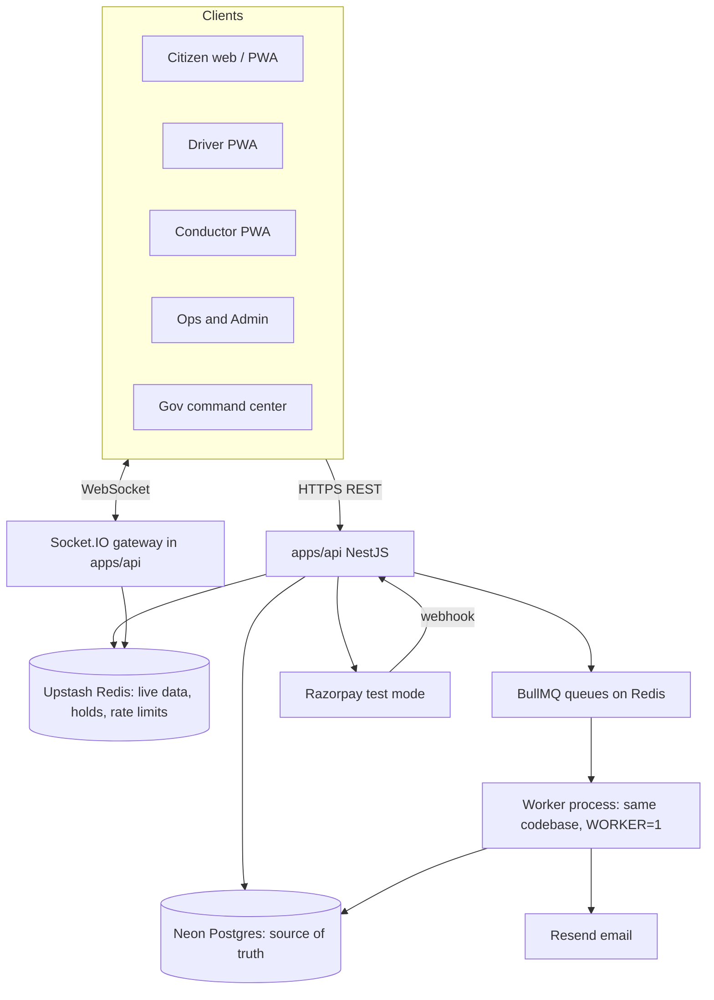
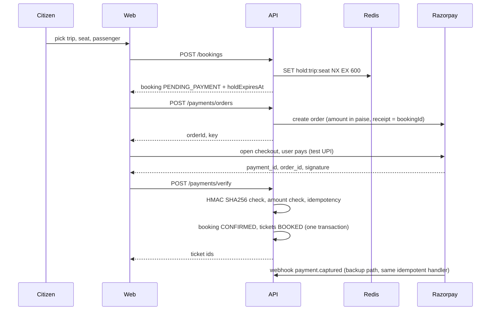
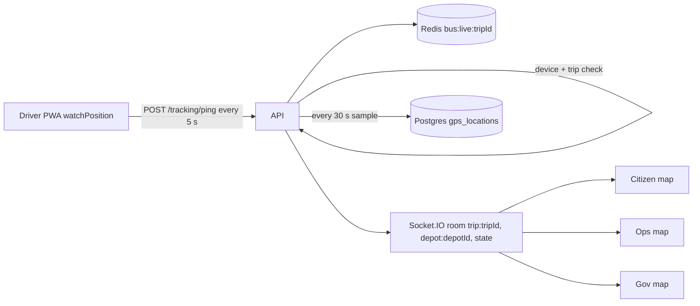

# 03 · Architecture

**Status: LOCKED.** Source: plan sec 54 to 64, 83. Decisions: [ADR 001](adr/001-monorepo.md), [ADR 002](adr/002-cloud-data.md).

## System view



One NestJS codebase runs in two modes: `api` (HTTP + Socket.IO) and `worker` (BullMQ consumers). On Render staging they are two services from the same repo.

## Monorepo layout

```
apps/
  web/
    app/
      (citizen)/        home, search, bus, book, tickets, passes, free-travel, track, timetable, updates, feedback, account
      (auth)/login/
      driver/
      conductor/
      ops/
      gov/
      admin/
      design/           component gallery (dev only)
    components/         app level components (compose packages/ui)
    lib/                api client, auth, query keys, socket client, formatters
    messages/           en.json, te.json
    public/             manifest, icons, fonts
  api/
    src/
      main.ts           http bootstrap
      worker.ts         worker bootstrap
      common/           guards, interceptors, filters, zod pipe, decorators
      prisma/           PrismaService (adapter-pg)
      redis/            RedisService (ioredis)
      modules/
        auth/ users/ network/ (districts, stands, stops, routes, timetables)
        trips/ bookings/ payments/ tickets/ passes/ eligibility/
        tracking/ incidents/ fleet/ staff/ notifications/ feedback/
        analytics/ admin/ audit/
    prisma/
      schema.prisma  migrations/  seed.ts
packages/
  shared/src/         schemas/ (zod), enums.ts, status.ts, money.ts, time.ts, fare.ts, errors.ts
  ui/src/             tokens.css, components/, icons.ts
  config/             eslint, tsconfig, prettier
scripts/
  check-dashes.mjs    simulate-trip.ts    check-links.mjs
```

## Module boundaries (api)

| Module | Owns tables | Talks to |
| --- | --- | --- |
| auth | otp_codes, refresh_tokens | users, notifications (email) |
| users | users, user_roles | audit |
| network | districts, bus_stands, stops, routes, route_stops, timetables | none |
| trips | trips, trip_assignments | network, fleet |
| bookings | bookings, booking_passengers, seat holds (Redis) | trips, payments |
| payments | payments, refunds | Razorpay, tickets |
| tickets | tickets, ticket_scans, ticket_transfers | bookings, notifications |
| passes | pass_types, passes | payments, eligibility |
| eligibility | eligibility_checks | provider interface (mock) |
| tracking | gps_locations, live keys in Redis | trips, socket gateway |
| incidents | incidents | tracking, trips, notifications |
| fleet, staff | buses, bus_types, depots, drivers, conductors, maintenance | trips |
| notifications | notifications | email provider, BullMQ |
| feedback | feedback, complaints | notifications |
| analytics | daily_stats (rollups) | read only on others |
| admin, audit | fare_rules, refund_policies, settings, audit_logs | all |

Rule: a module writes only its own tables. Cross module writes go through the owning service.

Domain events (plan sec 63): modules publish facts such as `booking.confirmed`, `ticket.activated`, `ticket.transferred`, `trip.started`, `trip.delayed`, `incident.created`, `trip.bus_replaced` on an in process `DomainEventsService` (an rxjs Subject in `common/events`). Notifications, audit and analytics subscribe. Publish only after the database transaction commits. A real broker is Phase 2.

## Key flows

### Book and pay (plan sec 52, 67)



### Live tracking (plan sec 22, 59, 62)



### Scan (plan sec 14, 67)

Conductor scans QR, `POST /tickets/validate`, server checks signature, rotating code, status, trip, date, activation, writes `ticket_scans`, returns VALID or INVALID with a reason code in under 300 ms.

## Environments

| Env | Web | API | DB | Redis | Payments |
| --- | --- | --- | --- | --- | --- |
| Local (each dev) | localhost:3000 | localhost:4000 | Neon branch `dev-a` or `dev-b` | own Upstash db | Razorpay test |
| Staging | Vercel | Render (api + worker) | Neon branch `main` | shared Upstash db | Razorpay test |
| Production | Out of scope. Government hosting rules decide (plan sec 83). |

Never test new features on staging data you cannot reset. `pnpm db:reset:staging` is Dev B only.

## Cross cutting rules

- API prefix `/api/v1`. JSON only. Errors follow the shape in [06-api-contract.md](06-api-contract.md).
- All request and response shapes are zod schemas in `packages/shared`, imported by both apps. No duplicated types.
- IDs: `cuid2` strings for public ids. Ticket codes: human readable `APT-XXXX-XXXX` (Crockford base32).
- Money: integer paise. Time: UTC in DB, `Asia/Kolkata` in UI.
- Redis is never the record. Anything that matters is also in Postgres.
