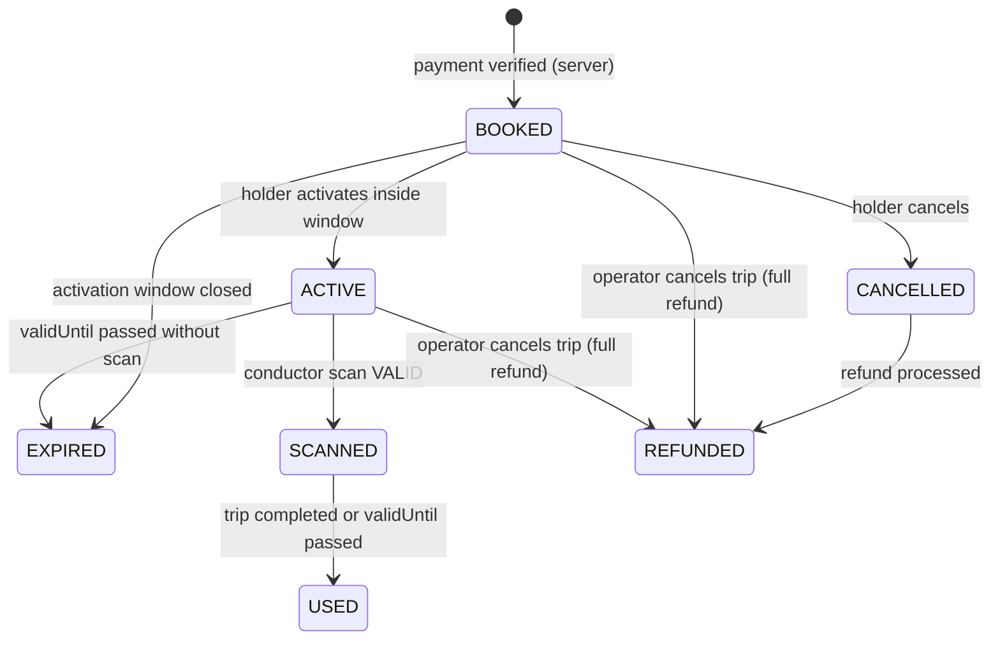
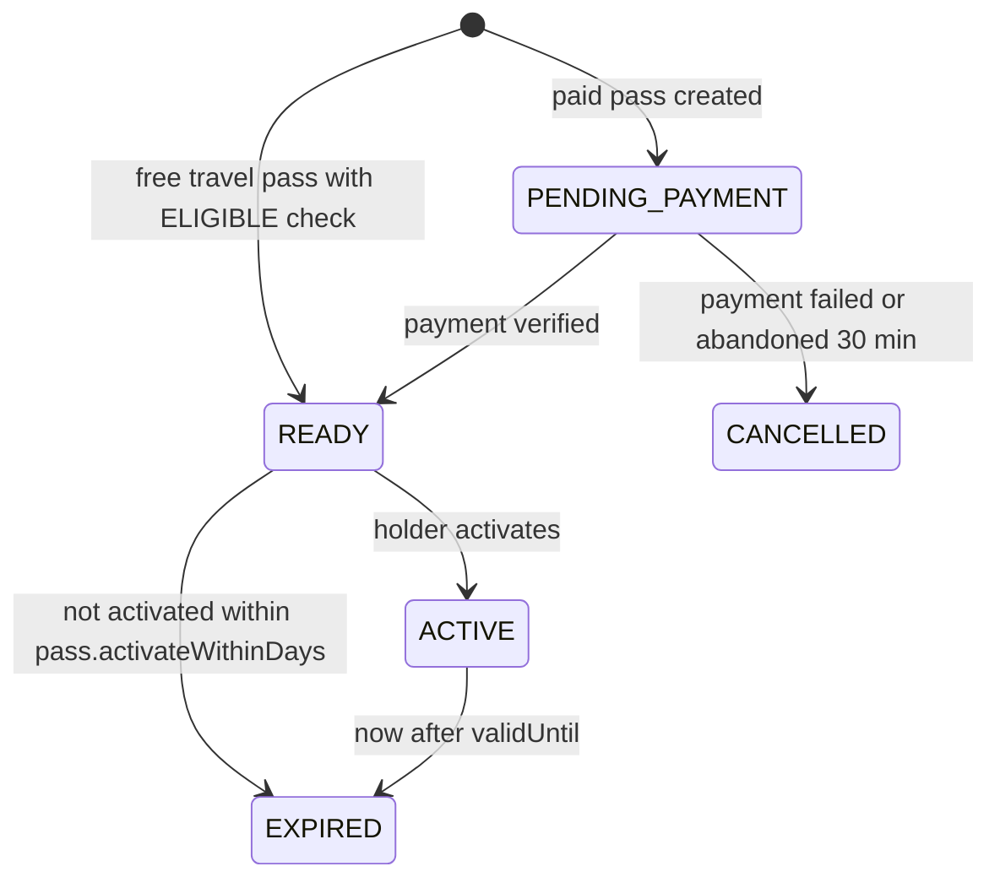

# 07 · Ticket and pass rules

**Status: LOCKED.** Source: plan sec 12 to 21, 52, 53, 99, 103 to 106. Every number marked **(A)** is our assumption, stored in the `settings` or policy tables so the authority can change it without a deploy. All (A) items are listed in [18-open-decisions.md](18-open-decisions.md).

These rules are implemented once, in `apps/api/src/modules/tickets/ticket-rules.ts` and `passes/pass-rules.ts`, with unit tests for every row of every table below.

## 1. Settings (defaults)

| Key | Default | Meaning |
| --- | --- | --- |
| `booking.holdMinutes` | 10 **(A)** | Seat hold during payment |
| `booking.maxPassengers` | 6 **(A)** | Per booking |
| `booking.daysAhead` | 30 **(A)** | How far ahead a trip can be booked |
| `booking.closeMinutesBefore` | 10 **(A)** | Booking closes this long before departure from the boarding stop |
| `activation.opensMinutesBefore` | 60 **(A)** | Activation opens before scheduled departure from the boarding stop |
| `activation.closesMinutesAfter` | 30 **(A)** | Activation closes after scheduled departure (plus current delay) |
| `ticket.graceMinutesAfterArrival` | 60 **(A)** | Active ticket stays valid after scheduled arrival at the dropping stop (plus delay) |
| `gift.cutoffMinutesBefore` | 120 **(A)** | Gifting closes this long before departure |
| `gift.maxTransfers` | 1 **(A)** | A ticket can be gifted once |
| `pass.activateWithinDays` | 30 **(A)** | A bought pass must be activated within this time |
| `qr.periodSec` | 30 | Rotating code period |
| `qr.windowSteps` | 1 | Accept previous, current and next period |

## 2. Ticket status machine



| From | To | Who | Condition | Error if not met |
| --- | --- | --- | --- | --- |
| (none) | BOOKED | Server | Payment HMAC valid, amount equals booking total, booking not expired. Free travel: valid eligibility and active FREE_TRAVEL pass | `PAYMENT_SIGNATURE_INVALID`, `PAYMENT_AMOUNT_MISMATCH`, `HOLD_EXPIRED` |
| BOOKED | ACTIVE | Holder | now is inside the activation window, trip not cancelled | `ACTIVATION_WINDOW_CLOSED`, `TICKET_NOT_ACTIVATABLE` |
| ACTIVE | ACTIVE | Holder | Second activate call | `TICKET_ALREADY_ACTIVE` (409). Double activation is impossible |
| BOOKED | CANCELLED | Holder | At least 60 min before departure, not activated | `TICKET_NOT_CANCELLABLE` |
| ACTIVE | SCANNED | Conductor | Validation passes (section 5) | Scan result INVALID with reason |
| SCANNED | USED | Server job | Trip COMPLETED, or now after `validUntil` | |
| BOOKED | EXPIRED | Server job | Activation window closed | |
| ACTIVE | EXPIRED | Server job | now after `validUntil` and never scanned | |
| CANCELLED | REFUNDED | Server | Razorpay refund processed | |
| BOOKED or ACTIVE | REFUNDED | Server | Operator cancelled the trip. 100 percent refund including fees | |

Every transition:
- runs in a DB transaction with an optimistic lock on `tickets.version`,
- writes an `audit_logs` row,
- emits `ticket:status` to the holder's `user:<id>` room.

**Activation times**

- `validUntil = scheduledArrivalAt(droppingStop) + trip.delayMinutes + ticket.graceMinutesAfterArrival`
- Window opens at `scheduledDeparture(boardingStop) minus activation.opensMinutesBefore`
- Window closes at `scheduledDeparture(boardingStop) + trip.delayMinutes + activation.closesMinutesAfter`

## 3. Citizen facing ticket labels

| Status | English label | Badge tone | Actions shown |
| --- | --- | --- | --- |
| BOOKED | Not active | neutral | Activate (when window open), Gift, Cancel |
| ACTIVE | Active | info | Show QR |
| SCANNED | Checked | success | Show QR (read only) |
| USED | Used | neutral | Give feedback |
| CANCELLED | Cancelled | danger | Refund status |
| REFUNDED | Refunded | neutral | None |
| EXPIRED | Expired | neutral | None |

Telugu labels live in `te.json`, see [10-ux-writing.md](10-ux-writing.md).

## 4. QR format and anti fraud

See [ADR 003](adr/003-qr-signing.md).

**Token (static, signed by the server)**

```
APT1.<base64url(payload)>.<base64url(ed25519 signature)>
payload = { "t": "T" or "P", "i": "<ticket or pass id>", "tr": "<tripId or null>", "d": "<YYYY-MM-DD or null>", "v": <validUntil epoch sec>, "k": "<keyId>" }
```

**Rotating code (client side, changes every 30 s)**

```
step = floor((Date.now() + serverOffsetMs) / 1000 / 30)
code = base32(HMAC_SHA256(rotSecret, step)).slice(0, 8)
QR content = token + "~" + code
```

- `rotSecret` is random 32 bytes per ticket or pass, stored encrypted (AES 256 GCM, key `QR_SECRET_KEY`), sent to the holder only when ACTIVE, and replaced on every transfer.
- Server accepts steps `current minus 1` to `current plus 1`. A screenshot fails after about 60 seconds with reason `STALE_CODE`.
- The ticket screen also shows: a slowly moving gradient band, a live clock with seconds, and the **colour of the day** (7 colour cycle by weekday, from `status.ts`). Conductors know the colour of the day. Motion respects reduced motion by keeping the clock and colour but stopping the band.
- Screen brightness hint: the ticket page asks the holder to raise brightness. It never forces it.

## 5. Scan validation order

The server checks in this exact order and returns the first failing reason. Every attempt is written to `ticket_scans`.

| # | Check | Reason on failure |
| --- | --- | --- |
| 1 | QR parses as `APT1.x.y~code` | `NOT_FOUND` |
| 2 | Ed25519 signature valid for `keyId` | `BAD_SIGNATURE` |
| 3 | Rotating code valid for current window | `STALE_CODE` |
| 4 | Ticket or pass exists | `NOT_FOUND` |
| 5 | Status CANCELLED or REFUNDED | `CANCELLED` |
| 6 | Status EXPIRED, or now after `validUntil` | `EXPIRED` |
| 7 | Status BOOKED (ticket) or READY (pass) | `NOT_ACTIVATED` |
| 8 | Ticket status SCANNED or USED, or pass already scanned on this trip | `ALREADY_SCANNED` |
| 9 | Ticket `tripId` equals the conductor's current trip | `WRONG_TRIP` |
| 10 | Service date equals today (IST) | `WRONG_DATE` |
| 11 | Pass: trip service type is in `eligibleServiceTypes` | `SERVICE_NOT_ELIGIBLE` |
| 12 | All good: ticket ACTIVE to SCANNED (optimistic lock). Pass: record scan | `OK`, result VALID |

Target: p95 under 300 ms server side, under 2 s from camera to green screen.

Scanner screen (plan sec 14, 28): VALID shows passenger name, seat, route, boarding and dropping. INVALID shows the reason in large text plus the time of the earlier scan when the reason is `ALREADY_SCANNED`.

## 6. Cancellation and refund

Refund tiers come from the active `refund_policies` row. Default **(A)**:

| Time before departure from boarding stop | Refund of fare | Reservation fee |
| --- | --- | --- |
| 24 hours or more | 90 percent | Not refunded |
| 12 to 24 hours | 75 percent | Not refunded |
| 1 to 12 hours | 50 percent | Not refunded |
| Under 1 hour | Not cancellable | |
| Trip cancelled by operator | 100 percent | Refunded |

- Only BOOKED tickets can be cancelled by the holder. Active, scanned, used or free tickets cannot.
- Amount math is in `packages/shared/src/fare.ts` (`refundQuote`), shared by the quote endpoint and the cancel endpoint, with unit tests.
- Refund request goes to Razorpay test mode. Status moves PENDING to PROCESSED through the webhook. The ticket shows "Refund in progress" until then.

## 7. Gifting (plan sec 21, 104)

A ticket can be gifted only when **all** are true:

| Rule | Error |
| --- | --- |
| `type` is SINGLE (paid). FREE_TRAVEL and concession tickets never | `TICKET_NOT_GIFTABLE` |
| `status` is BOOKED (not activated, not scanned) | `TICKET_NOT_GIFTABLE` |
| `transferCount` below `gift.maxTransfers` | `TICKET_NOT_GIFTABLE` |
| now is before departure minus `gift.cutoffMinutesBefore` | `TICKET_NOT_GIFTABLE` |
| Recipient is a registered user found by phone or email | `RECIPIENT_NOT_FOUND` |
| Recipient is not the holder | `GIFT_TO_SELF` |

On success, in one transaction: `holderUserId` becomes the recipient, passenger name becomes the recipient's profile name (or their masked phone or email when no name is set), `transferCount` plus 1, new `rotSecret`, a `ticket_transfers` row, an audit row, a `TICKET_RECEIVED` notification to the recipient, and a confirmation to the sender. The sender loses access immediately.

## 8. Passes (plan sec 16 to 18, 102)

| Pass type | Price **(A)** demo value | Duration | Valid on |
| --- | --- | --- | --- |
| Weekly | 450 rupees | 7 days from activation | Pallevelugu, Ultra Pallevelugu, City Ordinary, Metro Express, Express |
| Monthly | 1,600 rupees | 30 days from activation | Same as weekly |
| Free travel (Stree Shakti) | 0 | Until the eligibility check expires (365 days **(A)**) | Pallevelugu, Ultra Pallevelugu, City Ordinary, Metro Express, Express |

Pass status machine:



- `validFrom = activatedAt`, `validUntil = activatedAt + durationDays`. Example: activated 10 September 08:00 IST, valid until 17 September 08:00 IST.
- Countdown on screen: "5 days 08 hours 21 minutes" (sec 16). Under 24 hours: "08 hours 21 minutes 09 seconds" updating every second. Updates on its own, no refresh.
- One active pass per kind per user.
- Passes are never giftable.
- A pass can be scanned once per trip. Unlimited trips while ACTIVE.
- `PASS_EXPIRING` notification 24 hours before `validUntil`.

## 9. Free travel (plan sec 19, 20, 51, 103)

Modelled on the AP Stree Shakti scheme (launched 15 August 2025): zero fare travel for girls, women and transgender persons with AP domicile, on Pallevelugu, Ultra Pallevelugu, City Ordinary, Metro Express and Express services, after the conductor checks a photo ID.

Flow in our app:

1. Citizen opens Free travel, reads a short plain language consent screen.
2. Citizen declares category and AP domicile, picks which photo ID they will carry. **No ID number is entered or stored.**
3. The `EligibilityProvider` interface is called. MVP uses `MockEligibilityProvider`: ELIGIBLE when consent and declaration are true. A real government provider plugs in later (sec 51).
4. ELIGIBLE: a FREE_TRAVEL pass is created in READY, the citizen activates it.
5. NOT_ELIGIBLE: show the reason in plain words and what to do next. Never a dead end.
6. On board: the conductor scans the pass QR and checks the physical photo ID. Non eligible service type returns `SERVICE_NOT_ELIGIBLE`.
7. Reserved seats on eligible services can be booked at zero fare: a FREE_TRAVEL ticket (farePaise 0, no payment, `giftable` false).
8. Free tickets and passes can **never** be gifted (sec 20, 105).

## 10. Core rules (plan sec 105), where each is enforced

| Rule | Enforced in |
| --- | --- |
| A ticket cannot be used once invalid | Validation order, section 5 |
| Activation is saved on the server | `POST /tickets/:id/activate`, audit row |
| A scanned or used ticket cannot be used again | Check 8 plus optimistic lock |
| Only eligible tickets can be gifted | Section 7 |
| Free or concession tickets cannot be gifted | Section 7, first rule |
| Passes show an expiry countdown | Section 8 |
| Only approved drivers and devices send GPS | [13-realtime-tracking.md](13-realtime-tracking.md) |
| Sensitive admin actions need permissions | [08-roles-permissions.md](08-roles-permissions.md) |
