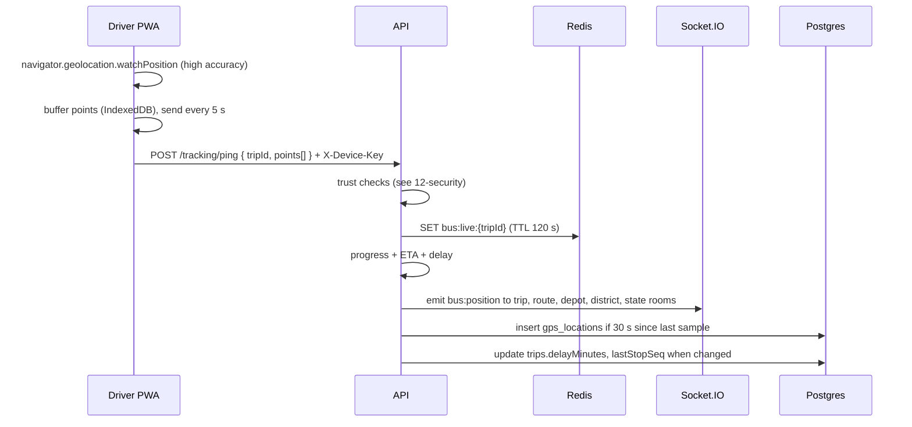

# 13 · Realtime tracking

**Status: LOCKED.** Source: plan sec 22 to 24, 39, 59, 62, 70, 98. Owner: Dev B (server), Dev A (driver app, maps).

## Flow

## Driver side

- `watchPosition` with `enableHighAccuracy: true`, `maximumAge: 5000`, `timeout: 15000`.
- Send interval: every 5 s while moving, every 20 s when speed under 2 km/h for 1 min (saves battery and data, plan sec 62).
- Buffer: up to 500 points in IndexedDB when offline. Flush in batches of 20 when back online (plan sec 77).
- Screen Wake Lock during a running trip. Re acquire on `visibilitychange`.
- GPS status shown to the driver: Active (fix under 30 s old, accuracy under 50 m), Weak (accuracy over 50 m or fix 30 to 90 s old), Off (no fix over 90 s or permission denied).
- Known limit: a web app cannot send GPS when the screen is off or the browser is killed. The driver keeps the app open (wake lock). Native app is Phase 2.

## Redis keys

| Key | Value | TTL |
| --- | --- | --- |
| `bus:live:{tripId}` | JSON: lat, lng, speedKmh, headingDeg, recordedAt, nextStopSeq, etaNextStopSec, delayMinutes, progressPct | 120 s |
| `trip:lastSample:{tripId}` | epoch ms of last Postgres insert | 120 s |
| `depot:live:{depotId}` | SET of running tripIds | none, maintained on start and end |
| `hold:{tripId}:{seatNo}` | bookingId | 600 s |
| `rl:*` | rate limit counters | per window |
| `otp:lock:{target}` | 1 | 900 s |

Redis is never the record (plan sec 58). If Redis is flushed, live positions refill within 5 s from the next pings.

## Progress, ETA and delay (fixed math, no AI)

Implemented in `apps/api/src/modules/tracking/progress.ts`, pure functions with unit tests.

1. **Snap to route.** Project the point onto the route polyline, get `kmAlong`.
2. **Current stop.** The last `route_stops` row with `kmFromOrigin <= kmAlong + 0.2`. A stop counts as reached when the bus comes within 150 m of it.
3. **Scheduled time at a stop** = `scheduledDepartureAt + minutesFromOrigin`.
4. **Delay** = `now minus scheduled time at the last reached stop`, in whole minutes, floored at 0. Update the trip when it changes by 2 min or more. Display DELAYED at 5 min or more.
5. **ETA to a stop** = `now + (stop.minutesFromOrigin minus lastReached.minutesFromOrigin) x paceFactor`, where `paceFactor` = actual minutes so far / scheduled minutes so far, clamped to 0.8 to 1.5. Before any stop is reached, `paceFactor` is 1.
6. **Progress percent** = `kmAlong / route.distanceKm`.
7. **Near stop notification** (`BUS_NEAR_STOP`) to ticket holders boarding at a stop when ETA is 10 min or less, once per ticket.
8. **Departed notification** (`TRIP_DEPARTED`) when the trip starts. **Delayed notification** (`TRIP_DELAYED`) when delay first crosses 10 min, then every further 15 min.

## Socket rooms

| Room | Who can join | Gets |
| --- | --- | --- |
| `trip:{id}` | anyone | `bus:position`, `trip:status`, `incident:*` for that trip |
| `route:{id}` | anyone | positions of all running trips on the route |
| `depot:{id}` | ops roles scoped to that depot, district and state roles | all trips of the depot, incidents, `kpi:update` |
| `district:{id}` | DISTRICT_OFFICER of that district and up | all trips of the district |
| `state` | TRANSPORT_OFFICER and up | everything, positions throttled to one per trip per 10 s |
| `user:{id}` | the user (auto) | notifications, ticket status |

## Maps

- MapLibre GL with OpenFreeMap tiles ([ADR 004](adr/004-maps-maplibre.md)). No API key, no cost.
- Citizen map: route line (done part in success tone, ahead in neutral), stops as dots, bus as a marker with a bus icon and heading, next stop highlighted. Map is decorative for screen readers; RouteProgress list carries the same facts.
- Ops map: depot buses coloured by status tone, each with an icon (plan sec 29 colours resolved in [09](09-design-system.md)).
- Gov map: one marker per district at its HQ (from `bus_stands` of the district) coloured and labelled by delay level, clustered bus markers, incident markers. No district polygons in the MVP (no boundary data to license or maintain). Click drills down (plan sec 36).
- Default view: AP bounds `[76.7, 12.6, 84.8, 19.95]`.

## GPS simulator (for demos and tests)

`pnpm simulate --trip <tripId> --speed 10`

- Logs in as the assigned driver through the normal API (seed device key), starts the trip, then replays points along the route polyline at real pace times `speed`.
- Options: `--delay-at <stopSeq>:<minutes>` to inject a stall, `--breakdown-at <km>` to stop and report a BREAKDOWN incident.
- Uses the same `/tracking/ping` endpoint as the real driver app, so everything downstream is exercised.
- `pnpm simulate --all --depot KNL` runs every trip of the depot that is due now (demo mode for dashboards).

## Retention (plan sec 70)

- Raw samples every 30 s per running trip. About 2,880 rows per bus per day at 24 h, fewer in practice.
- Daily job deletes `gps_locations` older than 30 days. Delay facts survive in `trips` and `daily_stats`.
