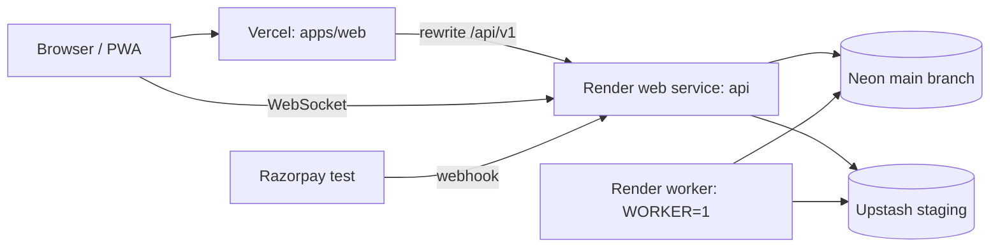

# 17 · Deployment (staging)

**Status: LOCKED.** Source: plan sec 81 to 84. Owner: Dev B. Production hosting is out of scope and decided with the authority (sec 83).

## Topology



## CI (GitHub Actions, created Day 1)

`.github/workflows/ci.yml` on every PR and push to `main`:

1. `pnpm install --frozen-lockfile`
2. `pnpm check:dashes`
3. `pnpm lint`
4. `pnpm typecheck`
5. `pnpm test` (unit + integration against the Neon `test` branch, secret `TEST_DATABASE_URL`)
6. `pnpm i18n:check` (from Day 3)
7. `pnpm build`
8. `pnpm audit --prod --audit-level high`
9. Playwright e2e job (from Day 10) against a preview build with the API started in the job

## Vercel (web)

- Root directory `apps/web`, framework Next.js, install `pnpm install`, build `pnpm turbo build --filter=web`.
- Env: `API_URL` (Render api URL), `NEXT_PUBLIC_WS_URL` (same), `NEXT_PUBLIC_RAZORPAY_KEY_ID`, `NEXT_PUBLIC_MAP_STYLE_URL`, `NEXT_PUBLIC_APP_ENV=staging`.
- Preview deployments for PRs point at the staging API (read only demo is fine).

## Render (api and worker)

| Service | Type | Build | Start | Env |
| --- | --- | --- | --- | --- |
| aptransit-api | Web service, Node 22 | `corepack enable && pnpm install --frozen-lockfile && pnpm turbo build --filter=api && pnpm --filter api prisma migrate deploy` | `node apps/api/dist/main.js` | all API vars, `APP_ENV=staging`, `WORKER=0`, `OTP_DEV_ECHO=0`, `WEB_ORIGIN=<vercel url>` |
| aptransit-worker | Background worker | same build without migrate | `node apps/api/dist/worker.js` | all API vars, `APP_ENV=staging`, `WORKER=1` |

- Health check path: `/api/v1/health`.
- Free web services sleep after 15 min idle and take about a minute to wake. Before any demo: open `/api/v1/health`, wait for 200, then run `pnpm simulate --all --depot KNL`.
- Razorpay webhook URL: `https://<render-api>/api/v1/payments/webhook`, events `payment.captured`, `payment.failed`, `refund.processed`.

## Seeding staging

```bash
DATABASE_URL=<neon main> DIRECT_URL=<neon main direct> pnpm db:reset:staging   # Dev B only, asks for confirmation
```

Seeds network, fleet, staff, 14 days of history and demo accounts ([19-seed-data.md](19-seed-data.md)).

## Smoke test after every deploy (5 minutes)

1. `GET /api/v1/health` returns `db: ok`, `redis: ok`.
2. Home loads, search Kurnool to Vijayawada for tomorrow returns trips.
3. Log in as `citizen@aptransit.test` (OTP from Render logs only if `OTP_DEV_ECHO=1` for the demo session, otherwise use a real inbox account).
4. Open an existing ticket, QR renders and rotates.
5. `/ops` as manager shows KPIs. `/gov` as transport officer shows the map.
6. Start the simulator for one trip, the tracking page moves.

## Backups and recovery (plan sec 84)

- Neon keeps point in time restore on the free plan for a short window. Before Day 19 and Day 20, create a named Neon branch snapshot `demo-backup-<date>`.
- Restore drill on Day 18: create a branch from the snapshot, point a local API at it, run the smoke test. Record the time it took in the daily log. A backup that was never restored is not trusted.

## Monitoring (plan sec 80)

- Render and Vercel logs. pino JSON with request id.
- Optional Sentry (free) for web and api errors from Day 18.
- `GET /api/v1/health` checked by a free uptime monitor (UptimeRobot or Better Stack) every 5 min during the demo week.
