# 99 · Source product plan

**Status: LOCKED. Original plan as provided by the product owner.** Other docs refer to it as "plan sec NN". Where the 20 day MVP differs, [02-mvp-scope.md](02-mvp-scope.md) and [18-open-decisions.md](18-open-decisions.md) explain why.

**AP TransitOS: Product, Technical and Implementation Plan**

---

## Part 1: Foundation

### 1. Project Overview

AP TransitOS is a digital public transport platform for Andhra Pradesh. The goal is not just a booking website. The goal is a **connected digital transport system**.

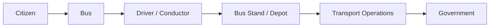

| Citizens can | Transport authorities can manage |
| --- | --- |
| Find buses and see timetables | Routes, timetables, trips |
| Book, activate and scan tickets | Buses, drivers, conductors |
| Track buses live | Tickets and passes |
| Buy weekly and monthly passes | Live bus locations |
| Use free travel schemes (if eligible) | Complaints and incidents |
| Get travel updates | Performance |
| Gift tickets, earn rewards, give feedback | Transport data |

### 2. Product Philosophy

**Keep it simple.** A citizen should open the app and understand it right away. The technology can be complex in the background. The user experience should not be.

- **Aim for:** simple, fast, clean, reliable, professional.
- **Avoid:** too many buttons, menus, alerts or details. Avoid complicated booking or ticketing.

### 3. Main Users

| User | What they do |
| --- | --- |
| **Citizen** | Search, book, pay, activate tickets, track buses, manage passes, get updates, give feedback, use rewards |
| **Driver** | Log in, see assigned bus and trip, start trip, share live location, report delays, incidents and breakdowns, end trip |
| **Conductor** | See assigned trip, scan and check tickets, check passenger status, report issues |
| **Bus Stand / Depot Staff** | Manage buses, trips, drivers, conductors and timetables. Watch live buses and delays. Handle incidents and maintenance |
| **Government / Transport Authority** | Watch the whole network, buses and routes. See ticket, pass and passenger data. Study demand, complaints and performance |

### 4. Product Structure

| Citizen App | Operations System | Government System |
| --- | --- | --- |
| Booking | Driver | Analytics |
| Tracking | Conductor | Command Center |
| Tickets | Bus | Reports |
| Passes | Trips | Planning |
| Rewards | Depot | Management |

---

## Part 2: Citizen App

### 5. Platforms

The citizen app is the most visible part of the platform. We start with a strong responsive web app and PWA.

- Responsive web app
- PWA
- Android app (later)
- iOS app (later)

### 6. Home Screen

Show only the main actions. Do not overload the screen.

```
+--------------------------------------+
| AP TransitOS                         |
|                                      |
| Where do you want to go?             |
| From  [ Kurnool                   ]  |
| To    [ Vijayawada                ]  |
|                                      |
|           [ Search Buses ]           |
|--------------------------------------|
| Track Bus       My Tickets           |
| My Passes       Timetable            |
|--------------------------------------|
| Updates                              |
+--------------------------------------+
```

### 7. Citizen Login

Users log in with phone number and email, checked by OTP. The final login method depends on government rules.

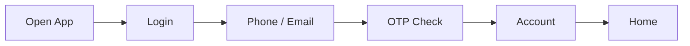

### 8. Bus Search

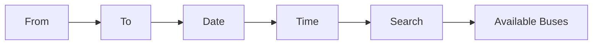

Each bus card shows only useful details:

| Departure | Service | Arrival (approx.) | Seats |
| --- | --- | --- | --- |
| 06:30 AM | Express | 12:10 PM | Available |
| 08:00 AM | Super Luxury | 02:00 PM | Available |

*Example route: Kurnool → Vijayawada*

### 9. Bus Details

**Shows:** bus name, number and type, departure, arrival time, fare, boarding points, destination, stops, seats left, live status.

**Actions:** Book Ticket, Track Bus, View Route.

### 10. Timetables

Timetables are a core feature. Users browse them step by step:

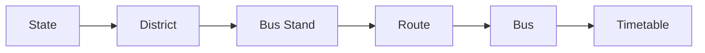

Users can see the first, last and next bus, how often buses run, the route, stops, departure time and arrival time. The operations team updates timetables from the admin system.

### 11. Ticket Booking

The user gets the ticket right after booking.

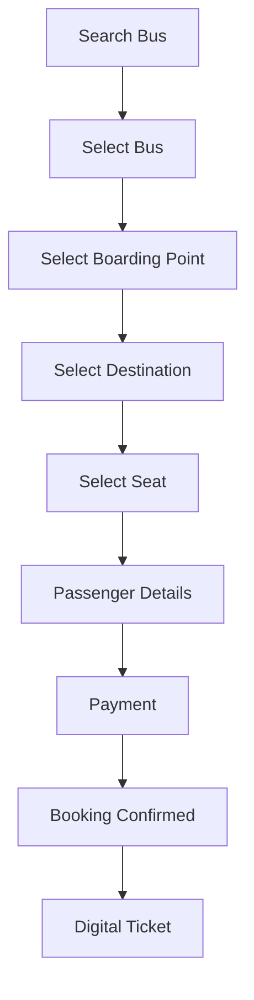

### 12. Digital Ticket

Each ticket has: passenger name, ticket ID, bus number, route, boarding point, destination, date, time, seat, fare, ticket status and a QR code or barcode.

```
AP TRANSITOS
Kurnool → Vijayawada
Bus:        AP XX XX XXXX
Seat:       18
Boarding:   Kurnool Bus Stand
Departure:  06:30 AM
Status:     ACTIVE

[ QR CODE ]
```

### 13. Ticket Activation

Activation is a separate step from booking. After activation, the ticket is valid based on ticket rules. Every activation is saved.

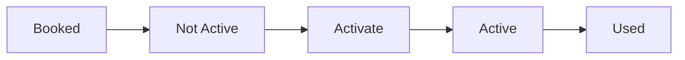

The system must stop double activation, reuse of used tickets, wrong transfers and fake ticket status.

### 14. QR / Barcode Scanning

**Goal: check a ticket in 5 to 10 seconds.**

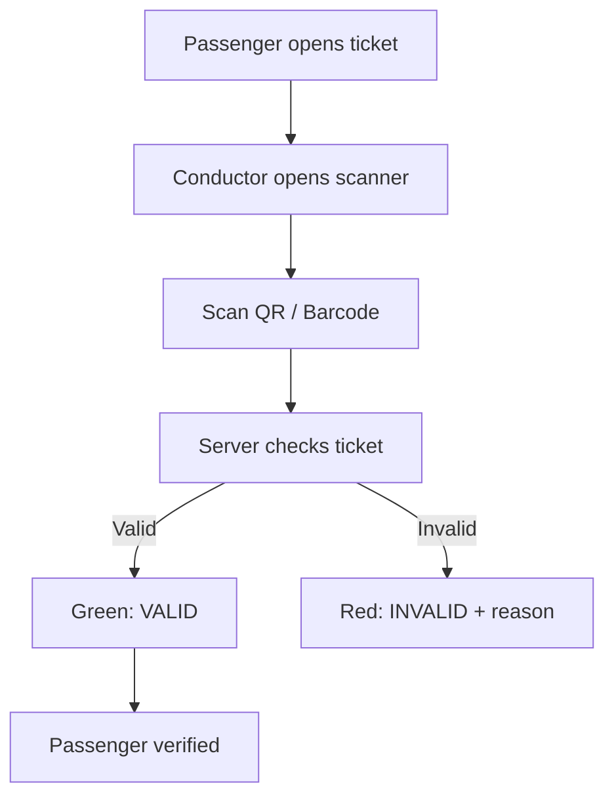

| Result | Scanner shows |
| --- | --- |
| Valid | VALID TICKET, passenger name, route, seat |
| Invalid | INVALID TICKET and the reason: already used, expired, wrong route, or not activated |

### 15. Ticket Status

Every ticket has one clear status. This helps stop misuse.

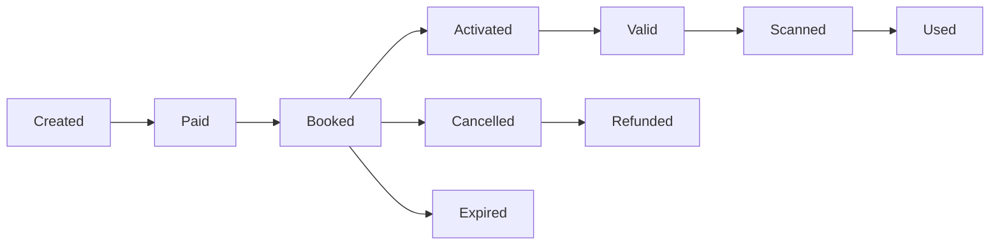

### 16. Weekly Pass

Users can buy a weekly pass (if eligible). It shows a live countdown.

| Field | Example |
| --- | --- |
| Valid from | 10 September |
| Valid until | 17 September |
| Time left | 5 days 08 hours 21 minutes |

### 17. Monthly Pass

Works the same way. Example: valid until 30 September, 18 days left. The countdown updates on its own.

### 18. Pass Activation

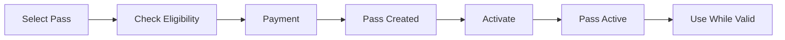

Final activation rules must be confirmed with the transport authority.

### 19. Free Bus for Women / Government Free Travel

The platform supports free travel schemes approved by the government.

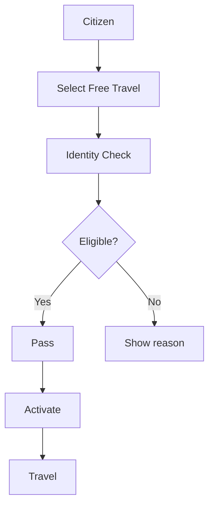

If the government requires it, Aadhaar based checks can be done through an approved process. What data is collected, how it is checked, who is eligible and how long data is kept must be decided by the government and the law.

### 20. Free Ticket Limits

Free tickets get stricter controls to reduce misuse.

| Ticket type | Can be gifted? |
| --- | --- |
| Paid ticket | Yes |
| Free / concession ticket | No |

### 21. Ticket Gifting

Eligible paid tickets can be gifted.

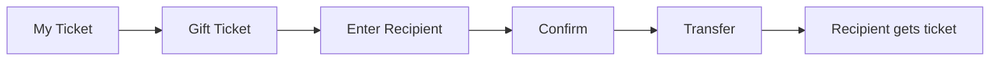

- **Saved:** original owner, recipient, ticket ID, transfer time, transfer status.
- A used or activated ticket cannot be transferred, unless final ticket rules allow it.

### 22. Live Bus Tracking

The driver's phone sends GPS, so passengers see the bus move almost in real time.

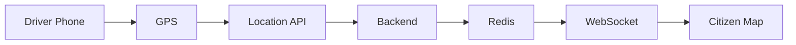

### 23. Bus Tracking Map

```
Kurnool      ●
             |
             🚌
             |
Nandyal      ●
             |
Destination  ●
```

The map shows current location, route covered, route ahead, next stop, ETA, delay and bus status.

### 24. Colour Codes

Colours show trip progress, so users do not need to read much.

| Colour | Meaning |
| --- | --- |
| Green | Completed |
| Blue | Current |
| White | Upcoming |
| Orange | Delayed |
| Red | Incident |

---

## Part 3: Driver and Conductor Apps

### 25. Driver App

| Before trip | During trip |
| --- | --- |
| Good morning. Today's bus: AP XX XX XXXX | TRIP ACTIVE, GPS: ACTIVE |
| Route: Kurnool → Vijayawada | Next stop: Nandyal, ETA 10:42 |
| Departure: 06:30 AM, Status: READY | [ REPORT ISSUE ] |
| **[ START TRIP ]** | **[ END TRIP ]** |

### 26. Driver Features

The driver should never need to use a complicated screen while driving.

- **Trip:** log in, see assigned bus and route, start trip, stop trip, share GPS.
- **Report:** delay, traffic, breakdown, accident, road block.
- **Updates:** see important notices.

### 27. Conductor App

The scanner is the most important button.

```
TODAY'S TRIP
Kurnool → Vijayawada
Passengers: 52   Checked: 39   Pending: 13

        [ SCAN TICKET ]
```

### 28. Fast Ticket Check

The scanner opens right away with a frame for the QR code ("Place QR inside the frame"). A good scan shows **VALID, Passenger verified, Seat 18** within 5 to 10 seconds.

---

## Part 4: Depot and Bus Stand Operations

### 29. Operations Dashboard

| Kurnool depot (example) | Count |
| --- | --- |
| Active buses | 161 |
| Total buses | 184 |
| Active trips | 1,284 |
| Delayed trips | 93 |
| Breakdowns | 3 |

**Bus status colours:** Green = Running, Yellow = Delayed, Red = Breakdown, Blue = Maintenance, White = Not assigned.

### 30. Bus Management

Every bus has a digital profile.

| Field | Example |
| --- | --- |
| Bus | AP XX 1234 |
| Bus type | Express |
| Depot | Kurnool |
| Driver / Conductor | XXXX / XXXX |
| Current route | Kurnool → Vijayawada |
| Status | Running |
| Maintenance due | 15 September |

### 31. Fleet Management

Operations can manage: bus registration, bus type, depot, driver, conductor, current status, maintenance, route and trip history.

### 32. Trip Management

Each trip saves: trip ID, bus, driver, conductor, route, start time, expected arrival, actual arrival, passengers, ticket count and status.

### 33. Incident Management

**Incident types:** breakdown, accident, traffic, road block, bus problem, medical emergency, other.

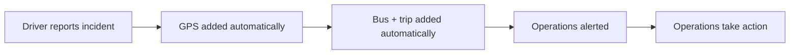

This cuts down on phone calls and manual work.

### 34. Replacement Bus

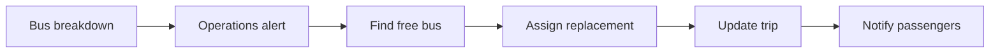

The exact steps depend on transport authority rules.

---

## Part 5: Government Command Center

### 35. Command Center

The main government dashboard shows the whole network on a live Andhra Pradesh map, with key numbers:

| Metric | Example |
| --- | --- |
| Active buses | 4,821 |
| Active trips | 8,942 |
| Passengers today | XXXXX |
| Delayed trips | XXX |
| Incidents | XX |

### 36. Map View

The government can go from the full state view down to a single bus and trip.

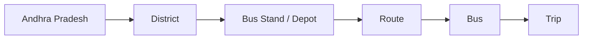

### 37. Transport Analytics

| Area | What is measured |
| --- | --- |
| **Route** | Passenger demand, number of trips, seats filled, delays, cancellations, revenue (where needed) |
| **Bus** | Trips, distance, usage, downtime, maintenance |
| **Passenger** | Tickets sold, pass usage, busy hours, route demand |

### 38. Demand Insights

Past bookings, ticket usage, routes, timetables and calendar data are used to study demand.

| Kurnool → Vijayawada | Demand |
| --- | --- |
| Morning | High |
| Afternoon | Medium |
| Evening | High |

This helps planners make decisions. It must not make government decisions on its own.

### 39. Delay Insights

GPS data is compared with the timetable to find delays and repeated patterns on each route.

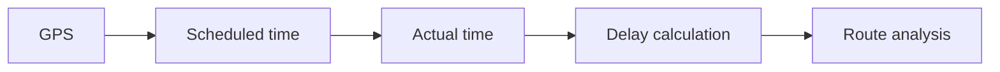

*Example:* Route 124 has an average delay of 18 minutes, mostly between 5 PM and 8 PM.

---

## Part 6: Citizen Engagement and Accessibility

### 40. Citizen Feedback

Keep feedback simple: **Email → Feedback → Submit.**

- **Optional details:** ticket ID, bus number, route, date, category.
- **Categories:** delay, cleanliness, staff, ticket, safety, overcrowding, other.

### 41. Complaint Flow

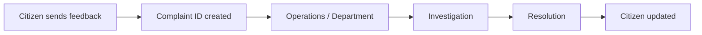

The government tracks the number of complaints, categories, time to resolve, and complaints by route and bus.

### 42. Lost and Found

Optional but useful. Citizens enter bus, date, time, route, lost item, description and email. Operations search the matching trip.

### 43. Notifications

Useful, not noisy. Use icons and short messages.

| Event | Message |
| --- | --- |
| Departure | Bus departed |
| Delay | Bus delayed |
| Arrival | Bus is near your stop |
| Ticket | Ticket activated |
| Route | Route update |
| Cancellation | Trip cancelled |
| Pass | Pass expiring soon |

### 44. Student Rewards

A simple reward system can be added later: student travel points, partner offers, local shop discounts, event offers, badges. Rewards must never be harder to use than the bus service itself.

### 45. Local Business Ads

Limited ad space for restaurants, cafes, shops, colleges, local services and events. Example: *"Local Offer: 20% OFF at ABC Restaurant [View Offer]"*.

Ads must never get in the way of booking, ticket scanning, live tracking or safety information. Transport is always the main product.

### 46. Local Events and Places

Work with local festivals, events, tourist places, sports, cultural programs and businesses to help people find the right bus.

*Example:* Event today: Kurnool Cultural Festival. Buses from Kurnool Bus Stand. [View Routes]

### 47. Accessibility

- Clear text and high contrast
- Simple navigation and large buttons
- Works with screen readers
- Colour is never the only signal (always show words like "Running" or "Delayed" too)
- Telugu and English support

### 48. Telugu and English

The app launches in **English** and **తెలుగు**. More languages can be added later. All translations are managed in one place, not written directly into the code.

---

## Part 7: Access, Security, Identity and Payments

### 49. Login and Roles

Each role gets only the access it needs for its job.

| Field roles | Management roles | Admin roles |
| --- | --- | --- |
| Citizen | Depot Manager | State Admin |
| Driver | District Officer | Super Admin |
| Conductor | Transport Officer | |
| Depot Staff | | |

### 50. Security

Follow OWASP security practices.

| Area | Needs |
| --- | --- |
| Identity | Secure login, OTP check, extra login step (MFA) for senior staff, session management |
| Access | Role based access, API permission checks |
| Data | Encryption, password hashing, safe file uploads |
| Protection | Rate limits, input checks |
| Payments and audit | Safe payment handling, audit logs |

### 51. Aadhaar / Identity Check

Free travel schemes may need an identity check. The platform should not store Aadhaar data it does not need. It only receives the eligibility result.

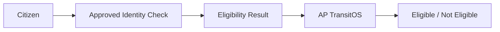

How this connects, what is stored, consent and data rules must be agreed with the government and the approved identity provider.

### 52. Payments

**Methods:** UPI, cards, net banking, other approved methods.

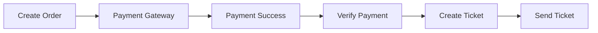

**Rule:** never create a paid ticket just because the app screen says payment worked. The server must check the payment first.

### 53. Refunds

Refund rules must be easy to change.

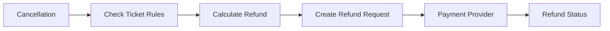

---

## Part 8: Technical Architecture

### 54. System Architecture

```mermaid
flowchart TD
  A[Citizen: Web / PWA / Mobile] --> B[API Gateway]
  B --> C[Identity / Booking / Tracking]
  C --> D[Transport Core<br/>Routes, Trips, Fleet,<br/>Timetable, Tickets, Maintenance]
  D --> E[Data Platform<br/>PostgreSQL, Redis, Event Queue]
  E --> F[Analytics]
  F --> G[Government Dashboard]
```

### 55. Technology Stack

| Layer | Technology | Why |
| --- | --- | --- |
| Frontend | Next.js, React, TypeScript, Tailwind CSS, PWA | Fast, good for search engines, easy routing, server rendering, easy to deploy |
| Backend | NestJS, TypeScript, REST API, WebSockets | Clear structure, modules, built-in checks, good for large apps |
| Database | PostgreSQL + Prisma ORM | Main source of truth, type safe data access |
| Cache / live data | Redis | Data that changes fast |
| Real time | Socket.IO | Live location and status updates |
| Background jobs | BullMQ | Tasks that run outside the main request |
| Maps | Google Maps Platform or Mapbox | Tracking, routes, ETA |

### 56. Backend Modules

Auth, Users, Routes, Stops, Timetables, Buses, Drivers, Conductors, Trips, Bookings, Tickets, Passes, Payments, Tracking, Notifications, Feedback, Rewards, Ads, Events, Analytics, Admin.

### 57. Database: PostgreSQL

Main database for users, buses, routes, stops, timetables, trips, bookings, tickets, payments, passes, feedback, drivers, conductors, roles and audit logs. Use **Prisma ORM** for safe, typed access.

### 58. Redis

For data that changes fast: live bus locations, active sessions, short-term ticket check data, rate limits, caching, live status.

Redis is never the main record. PostgreSQL is.

### 59. Real Time Updates: Socket.IO

WebSockets send live bus location, driver status, trip status, operations alerts and ticket status where needed.

```mermaid
flowchart LR
  A[Driver GPS] --> B[Backend] --> C[Redis] --> D[Socket.IO] --> E[Passenger]
```

### 60. Background Jobs: BullMQ

Used for notifications, email, SMS, pass expiry, ticket expiry, reports, analytics and data sync.

*Example:* pass expires tomorrow → BullMQ job → SMS / email / push message.

### 61. Maps

Pick Google Maps Platform or Mapbox based on cost, map quality in Andhra Pradesh, routing needs, API limits, licensing and government buying rules.

**Used for:** bus tracking, route display, stops, ETA, distance, location.

### 62. GPS Tracking

Only the driver's approved device sends GPS.

```mermaid
flowchart LR
  A[Driver App] --> B[GPS] --> C[Location Service] --> D[Backend API] --> E[Redis] --> F[WebSocket] --> G[Live Map]
```

How often GPS updates is a balance between accuracy, battery, mobile data and server load.

### 63. Event Based Design

In larger setups, important actions send events that other services pick up. This makes the system easier to grow.

```mermaid
flowchart LR
  A[Ticket Created] --> B[TicketCreated event]
  B --> C[Notification]
  B --> D[Analytics]
  B --> E[Audit]
  B --> F[Rewards]
```

*Another example:* Bus breakdown → incident created → operations alert → passenger update → analytics.

### 64. File Storage

Use object storage for user documents (if needed), bus and driver documents, reports, invoices and other approved files. Do not store large files in PostgreSQL.

### 65. Notification Service

**Channels:** push, SMS, email.

**Used for:** booking confirmation, ticket activation, bus delay, bus cancellation, pass expiry, trip update, complaint update.

### 66. API Structure

| Area | Endpoints |
| --- | --- |
| Identity | `/api/auth`, `/api/users` |
| Network | `/api/routes`, `/api/stops`, `/api/timetables` |
| Fleet and staff | `/api/buses`, `/api/drivers`, `/api/conductors`, `/api/trips` |
| Sales | `/api/bookings`, `/api/tickets`, `/api/passes`, `/api/payments` |
| Live | `/api/tracking`, `/api/notifications` |
| Engagement | `/api/feedback`, `/api/rewards`, `/api/events`, `/api/ads` |
| Management | `/api/admin`, `/api/analytics` |

### 67. Ticket API Example

| Step | Call | What the server does |
| --- | --- | --- |
| Book | `POST /bookings` | Create booking |
| Pay | `POST /payments/verify` | Check payment, then create ticket |
| View | `GET /tickets/:id` | Return ticket |
| Activate | `POST /tickets/:id/activate` | Check ticket, owner and expiry, then activate |
| Scan | `POST /tickets/validate` | Find ticket, check status, route, date and activation, then return VALID or INVALID |

### 68. Main Database Tables

This is a starting model. The final design is done before coding.

| Area | Tables |
| --- | --- |
| Identity | users, roles, user_roles |
| Fleet and staff | buses, bus_types, drivers, conductors |
| Network | depots, bus_stands, routes, route_stops, stops, timetables |
| Operations | trips, trip_assignments, gps_locations, incidents |
| Booking and tickets | bookings, booking_passengers, tickets, ticket_scans, ticket_transfers |
| Passes and money | passes, pass_types, payments, refunds |
| Engagement | notifications, feedback, complaints, rewards, reward_transactions, advertisements, events |
| Records | audit_logs |

### 69. Ticket Data

- **Ticket record:** ticket ID, booking ID, passenger ID, trip ID, bus ID, route ID, seat, fare, ticket type, status, activation time, scan time, expiry time, created time.
- **Transfer record:** ticket ID, original user, new user, transfer time, transfer status.

### 70. GPS Data

Each record has bus ID, trip ID, latitude, longitude, speed, direction and time. GPS data grows very fast, so do not keep every point forever. Set a clear data deletion plan.

---

## Part 9: Admin, Reports and AI

### 71. Admin Dashboard

Sections: Dashboard, Routes, Stops, Timetables, Buses, Drivers, Conductors, Trips, Tickets, Passes, Payments, Incidents, Feedback, Events, Ads, Reports, Users, Settings, Audit Logs.

Permissions decide what each admin can see and do.

### 72. Government Reports

| How often | Reports |
| --- | --- |
| Daily | Trips, passengers, tickets, revenue, delays, incidents |
| Weekly | Route performance, bus usage, complaint trends, pass usage |
| Monthly | Route demand, fleet usage, service performance, ticket trends, district comparison |

Reports can be exported where the government needs it.

### 73. AI Features

AI helps people. It never makes important transport decisions.

| Assistant | Example question |
| --- | --- |
| Citizen | "When is the next bus to Nandyal?" |
| Staff | "Show delayed buses in Kurnool." |
| Government | "Summarise route delays this week." |
| Feedback sorting | Groups feedback into delay, cleanliness, staff, ticket, safety, other |

Important numbers always come from the database and fixed calculations. AI must never make up fares, ticket status, bus location, timetables, eligibility or payment status.

### 74. How Ads Work

```mermaid
flowchart LR
  A[Business] --> B[Ad] --> C[Admin Review] --> D[Approved] --> E[Campaign] --> F[Citizen App]
```

Admins control the advertiser, start and end dates, location, who sees it and status. Ads never cover important transport information.

### 75. How Events Work

```mermaid
flowchart LR
  A[Event] --> B[Location] --> C[Date] --> D[Bus Routes] --> E[Citizen Finds It]
```

*Example:* Kurnool event → nearest bus stand → available routes → timetable → passenger.

### 76. How Rewards Work

```mermaid
flowchart LR
  A[Eligible Activity] --> B[Reward Rule] --> C[Points] --> D[Reward Wallet] --> E[Partner Offer]
```

Rewards need controls to stop misuse.

---

## Part 10: Reliability, Testing and Infrastructure

### 77. Offline Support

Driver and conductor apps must keep working when the network drops for a while.

```mermaid
flowchart LR
  A[Online: download trip data] --> B[Offline: keep working] --> C[Save actions on phone] --> D[Network back] --> E[Sync to server]
```

If needed, ticket scanning also needs a well planned offline mode. Test it before going live.

### 78. Testing Plan

| Level | What to test |
| --- | --- |
| Unit | Ticket rules, fare calculation, pass expiry, eligibility, ticket activation, ticket transfer |
| Integration | Payment, booking, ticket, GPS, notifications |
| End to end | Search → Book → Pay → Ticket → Activate → Scan → Trip complete |

### 79. Performance Goals

| Area | Goal |
| --- | --- |
| Citizen search | Feels fast |
| Ticket | Opens quickly |
| Scanner | **5 to 10 seconds** per ticket |
| Live tracking | Updates often enough to feel live, without draining battery or data |
| Dashboards | Stay fast with large amounts of data |

Exact numbers will be set during technical design.

### 80. Monitoring

Watch API health, database, Redis, WebSockets, GPS, payments, notifications, background jobs, errors, speed and server resources. When something breaks, the operations team must know right away.

### 81. Deployment

```mermaid
flowchart LR
  A[GitHub] --> B[CI/CD] --> C[Build] --> D[Test] --> E[Deploy] --> F[Monitor]
```

Use separate environments: **Development → Staging → Production.** Never test new features directly in production.

### 82. Docker

Run services in Docker containers: frontend, backend, PostgreSQL, Redis, workers. Production hosting follows government rules.

### 83. Cloud Setup

```mermaid
flowchart TD
  A[Internet] --> B[CDN / WAF] --> C[Frontend / PWA] --> D[API Gateway]
  D --> E[Backend]
  D --> F[Workers]
  E --> G[PostgreSQL]
  E --> H[Redis]
  F --> I[BullMQ]
  H --> J[Real time layer: WebSockets]
```

Hosting and where data is stored are decided with the transport authority.

### 84. Backup and Recovery

Needed: database backups, backup checks, disaster recovery plan, recovery steps, audit logs, monitoring. A backup that has never been tested cannot be trusted.

---

## Part 11: Delivery Plan

### 85 to 91. Development Phases

| Phase | Focus | What to build |
| --- | --- | --- |
| **0. Research** | Requirements | Study existing apps, mobile tickets, ticket types, timetables, government rules and transport workflows. Finalise requirements |
| **1. Foundation** | Base platform | Architecture, login, user roles, database, admin base, routes, stops, timetables, buses |
| **2. Citizen MVP** | Main citizen journey | Login, search, timetable, bus details, booking, payment, digital ticket, activation, ticket history |
| **3. Live Transport** | Real time | Driver app, GPS, live tracking, route map, ETA, bus status, conductor scanner, ticket check |
| **4. Operations** | Depot tools | Depot dashboard, bus, driver, conductor and trip management, incidents, maintenance |
| **5. Government** | Oversight | Command center, district view, route, bus and passenger analytics, reports, audit logs |
| **6. Advanced Features** | Extras | Weekly, monthly and student passes, free travel, identity check, ticket gifting, rewards, local ads, events, places, AI assistant |

**Key Phase 0 task:** study existing mobile bus tickets (ticket types, ticket life cycle, activation, QR / barcode format, checking, passes, cancellation, refunds, gifting, free travel, concessions) before finalising the ticket database.

### 92. Phase 7: Pilot

Do not launch across the whole state at once. Start with a small pilot.

```mermaid
flowchart LR
  A[Selected area] --> B[Selected bus stands] --> C[Selected routes] --> D[Selected buses] --> E[Real users] --> F[Measure] --> G[Fix] --> H[Expand]
```

### 93. Pilot KPIs

| Group | Measure |
| --- | --- |
| Citizen | Search usage, completed bookings, ticket activation, scan time, live tracking usage, pass usage |
| Operations | Trips completed, delay reports, incident response, GPS uptime |
| Government | Dashboard usage, data quality, reports created, complaints resolved |
| Experience | Average booking time, average ticket check time, app errors, user feedback |

### 94. Team Structure

```mermaid
flowchart TD
  A[Product Lead] --> B[Frontend Team]
  A --> C[Backend Team]
  B --> D[Mobile / PWA]
  C --> E[Database / API]
  A --> F[Design / UX]
  A --> G[QA / Testing]
  A --> H[DevOps / Cloud]
```

In a small team, one person can take on several roles.

### 95. Design System

Build the design system before building pages. Define text styles, buttons, cards, forms, inputs, tables, maps, status badges, pop-ups, alerts, icons, navigation and mobile layouts.

**Same status labels everywhere:** Running, Delayed, Cancelled, Completed, Maintenance, Incident.

### 96. BlueStar Reference

Study the BlueStar app for ideas on mobile tickets, transport workflows, navigation, ticket display, operations flow and mobile first design.

AP TransitOS keeps its own design, architecture, database, business rules, API and user experience. Learn from it. Do not copy it.

---

## Part 12: End to End Flows

### 97. Citizen Journey

```mermaid
flowchart TD
  A[Open app + login] --> B[Enter from / to] --> C[See buses + timetable] --> D[Select bus + seat]
  D --> E[Passenger details + pay] --> F[Ticket created] --> G[Activate]
  G --> H[Track bus] --> I[Board + scan ticket] --> J[Travel] --> K[Trip completed] --> L[Feedback]
```

### 98. Live Tracking

```mermaid
flowchart LR
  A[Driver starts trip] --> B[GPS on] --> C[Location sent] --> D[Backend] --> E[Redis] --> F[WebSocket]
  F --> G[Citizen map]
  F --> H[Operations map]
  F --> I[Government map]
```

### 99. Ticket Life Cycle

```mermaid
flowchart LR
  A[Book] --> B[Pay] --> C[Ticket created] --> D[Activate] --> E[Active] --> F[Scan] --> G[Check] --> H[Used]
```

**Invalid cases:** expired, cancelled, already used, wrong trip, wrong date, not activated, invalid ticket.

### 100. Government Data

```mermaid
flowchart TD
  A[Live transport data] --> B[Data platform]
  B --> C[Routes] & D[Trips] & E[Fleet] & F[Tickets]
  C & D & E & F --> G[Analytics] --> H[Government dashboard] --> I[Decision support]
```

### 101. Incident

```mermaid
flowchart LR
  A[Driver reports] --> B[GPS captured] --> C[Bus + trip found] --> D[Operations alert] --> E[Response] --> F[Passenger update] --> G[Closed] --> H[Saved for analysis]
```

### 102. Pass

```mermaid
flowchart LR
  A[Select pass] --> B[Eligibility] --> C[Payment if needed] --> D[Pass created] --> E[Activation] --> F[Countdown] --> G[Use] --> H[Expiry]
```

### 103. Free Travel

```mermaid
flowchart LR
  A[Citizen] --> B[Identity check] --> C[Eligibility check] --> D[Eligible] --> E[Free ticket / pass] --> F[Activation] --> G[Scan] --> H[Travel]
```

Free travel tickets cannot be gifted.

### 104. Ticket Gifting

```mermaid
flowchart LR
  A[Paid ticket] --> B[Gift ticket] --> C[Recipient] --> D[Transfer] --> E[Recipient ticket] --> F[Activate] --> G[Scan]
  X[Free / concession ticket] --> Y[Gift: BLOCKED]
```

---

## Part 13: Rules, Open Decisions and Vision

### 105. Core Product Rules

Write these down clearly before development starts.

| Area | Rule |
| --- | --- |
| Ticket | Cannot be used once invalid |
| Activation | Saved on the server |
| Scan | A scanned or used ticket cannot be used again |
| Gifting | Only eligible tickets can be gifted |
| Free travel | Free or concession tickets cannot be gifted |
| Passes | Weekly and monthly passes show an expiry countdown |
| GPS | Only approved drivers and devices can send bus location |
| Admin | Sensitive actions need the right permissions |

### 106. To Decide Before Coding

- **Ticket types:** single trip, return (if needed), day ticket, weekly pass, monthly pass, student pass, government free ticket, concession ticket, event ticket (if needed).
- **Ticket rules:** activation, expiry, cancellation, refund, transfer, gifting, QR / barcode, offline checking.

### 107. Government Items to Confirm

- [ ] Official transport operator
- [ ] Bus data source
- [ ] Route and timetable data source
- [ ] GPS source
- [ ] Ticket and fare rules
- [ ] Free travel rules
- [ ] Identity check requirements
- [ ] Payment provider
- [ ] Refund rules
- [ ] Data storage and privacy rules
- [ ] Hosting requirements
- [ ] Government system connections

### 108. Data Flow Summary

```mermaid
flowchart TD
  A[Citizen: search / booking] --> B[AP TransitOS]
  B --> C[Routes → Database]
  B --> D[Tickets → Database]
  B --> E[GPS → Redis]
  C & D & E --> F[Operations] --> G[Government data] --> H[Command Center]
```

### 109. Full Platform

```mermaid
flowchart TD
  A[Citizen App<br/>Search, book, passes, tracking] --> D[Transport Core<br/>Routes, trips, fleet, tickets, passes]
  B[Driver App<br/>Trip, GPS, issues] --> D
  C[Conductor App<br/>Scan, check] --> D
  D --> E[Operations System<br/>Depot, incidents]
  E --> F[Data Platform<br/>Analytics, AI, reports]
  F --> G[Government Command Center]
```

### 110. How to Present It

Not "just another bus booking app", but **one connected digital platform that brings citizens, buses, transport staff and government together.**

| Who | What they get |
| --- | --- |
| Citizen | Simple travel |
| Driver | Simple daily work |
| Depot | Clear view of operations |
| Government | Better data for better decisions |

### 111. Product Principle

**Make public transport easier without making the app complicated.** The technology can be advanced. The experience stays simple.

### 112. Vision

| Citizen | Operations | Government |
| --- | --- | --- |
| Discover | Manage | Monitor |
| Book | Track | Analyse |
| Activate | Operate | Plan |
| Track | Respond | Improve |

**One transport network → AP TransitOS → better public transport.**

> Simple for citizens. Powerful for operations. Useful for government.
> One transport network. One connected digital platform.
